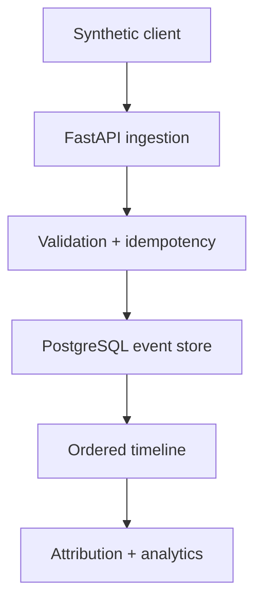

# Event Attribution Engine

A backend-focused service for ingesting synthetic product events and producing explainable first-touch and last-touch attribution.

The project explores the correctness problems behind event pipelines: duplicate delivery, missing identity, late arrival, malformed payloads and events received out of order. It does **not** claim to process real production traffic.

## What it is

Clients send `visit`, `click`, `signup`, `activation` and `conversion` events to a FastAPI endpoint. The service validates and stores each event idempotently, then rebuilds a user timeline by event time before calculating attribution.



## Why I built it

Product analytics looks simple until delivery becomes asynchronous. This repository makes those failure modes explicit and keeps the attribution logic small enough to review.

## Key engineering decisions

- `event_id` is the idempotency key; duplicate payloads return the existing record.
- Event time and received time are stored separately.
- Attribution replays a user's events by `(occurred_at, event_id)`, so late events are deterministic.
- Identity is required for funnel events; malformed or unsupported data fails at the API boundary.
- The sample store is in memory for an instant demo. A PostgreSQL schema and Docker service document the durable path.
- Logs are structured JSON and never include API keys.

## API

`POST /v1/events` ingests one event. `GET /v1/attribution/{user_id}` returns the ordered funnel and first/last touch. `GET /v1/analytics` returns deterministic counts.

```json
{
  "event_id": "evt-1004",
  "event_type": "conversion",
  "user_id": "user-42",
  "occurred_at": "2026-08-20T14:05:00Z",
  "source": "partner-demo",
  "properties": {"plan": "team"}
}
```

## Handling imperfect delivery

| Situation | Behavior |
|---|---|
| Duplicate event | Existing event returned; metrics are not incremented twice |
| Late event | Stored, then included in the next event-time replay |
| Out-of-order event | Timeline is sorted deterministically |
| Missing user identifier | Rejected for funnel events with a validation error |
| Malformed or unknown event | Rejected at the API boundary |

## Running locally

```bash
cp .env.example .env
docker compose up --build
python -m app.generator --count 20 --base-url http://localhost:8000
```

Without Docker:

```bash
python -m venv .venv && source .venv/bin/activate
pip install -r requirements.txt
uvicorn app.main:app --reload
```

## Testing

```bash
pytest -q
```

The tests cover duplicates, late delivery, stable ordering, identity validation and attribution.

## Future improvements

- Replace the demonstration store with the included PostgreSQL persistence boundary.
- Move projection rebuilding to a queue-backed worker.
- Add retention policies, tenant isolation and observable lag metrics.
- Add multi-touch weighting as a separate, versioned strategy.

## License

[MIT](LICENSE)
